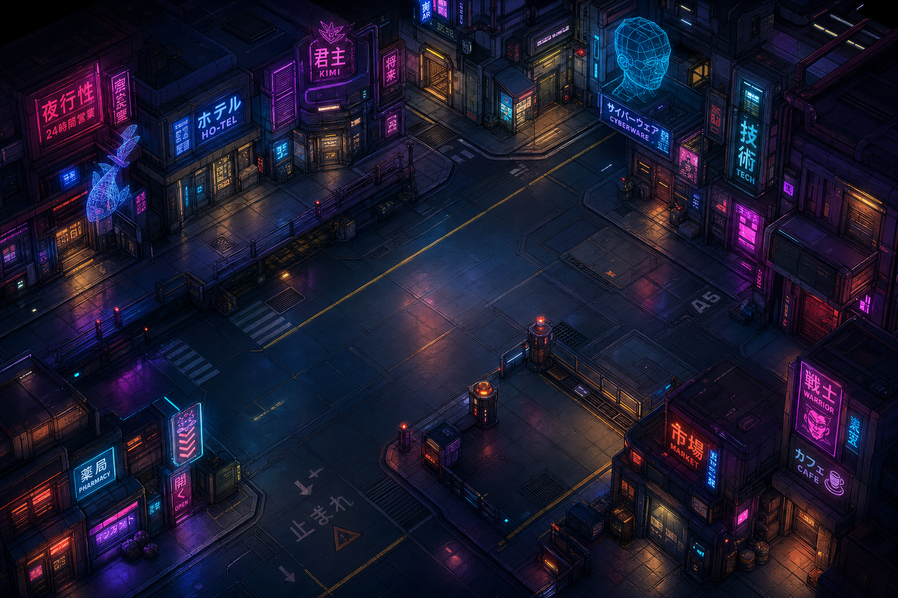

# OMSOLO: Neon Saber Rush

スタイリッシュなネオン・サイバーパンク・アクションゲーム。



## ゲーム概要
「OMSOLO」は、ハイスピードな剣戟とフォース能力を駆使して敵をなぎ倒す、2Dタクティカル・アクションゲームです。ネオン輝くサイバー世界を舞台に、迫りくる敵と巨大なボスを撃破せよ。

## プレイ方法
[GitHub Pagesでプレイする](https://<your-username>.github.io/オムソロ/) (GitHub Pages設定後にURLを差し替えてください)

### 操作方法
#### PC (キーボード)
- **移動**: `A` / `D` または `←` / `→`
- **ジャンプ**: `W` / `Space` / `↑`
- **攻撃**: `J` / `X`
- **フォース**: `K` / `C`
- **ダッシュ**: `L` / `Shift`

#### スマートフォン (ジェスチャー)
- **移動**: 左右にドラッグ
- **攻撃**: 画面をタップ
- **フォース**: 左右に素早くフリック
- **ジャンプ**: 上にスワイプ

## 開発者向け
このプロジェクトは HTML5 / JavaScript (Vanilla JS) で構築されています。

### ローカルでの実行方法
ブラウザのセキュリティ制約（CORS）を回避するため、ローカルサーバー経由で実行することをおすすめします。

```bash
# Pythonを使用する場合
python -m http.server 8000

# Node.js (serve) を使用する場合
npx serve .
```

## ライセンス
このプロジェクトは MITライセンスの下で公開されています。詳細は LICENSE ファイルをご覧ください。
